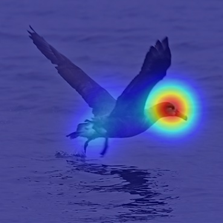
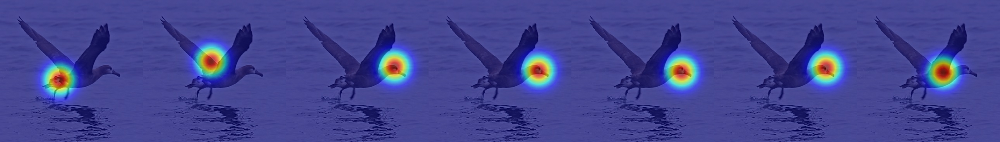

# HA-in-Fine-Grained-Classification
This repo includes the CUB-GHA (Gaze-based Human Attention) dataset and code of the paper ["Human Attention in Fine-grained Classification"](https://arxiv.org/pdf/2111.01628.pdf) accepted to BMVC 2021.


## CUB-GHA Dataset
To get the dataset, you need:
(1) CUB-200-2011 which can be downloaded [here](http://www.vision.caltech.edu/visipedia/CUB-200-2011.html).
(2) some python packages: numpy, matplotlib, scipy, PIL, tqdm.

"Fixation.txt" includes all gaze data from 5 runs of the data collection (after filtering gaze duration <0.1s). Inside the directory "data_5runs", you will find 5 files and each stands for 1 run of the collection. 

1. To get the all fixation points in one heatmap for each image, as shown in the example below, please run the command:
`python generate_heatmap.py --CUB_dir_path <path_to_CUB> --CUB_GHA_save_path <path_to_save_CUB_GHA> --gaze_file_path ./Fixation.txt`
	

2. To get single fixation heatmaps for each image, as shown in the example below, please run the command:
`python generate_heatmap.py --single_fixation --CUB_dir_path <path_to_CUB> --CUB_GHA_save_path <path_to_save_CUB_GHA> --gaze_file_path ./Fixation.txt`
	

If you use this dataset in your research, please cite
```
@article{rong2021human,
  title={Human Attention in Fine-grained Classification},
  author={Rong, Yao and Xu, Wenjia and Akata, Zeynep and Kasneci, Enkelejda},
  journal={arXiv preprint arXiv:2111.01628},
  year={2021}
}
```
We thank this [repo](https://github.com/TobiasRoeddiger/GazePointHeatMap) for providing some functions of gaze visualization.
